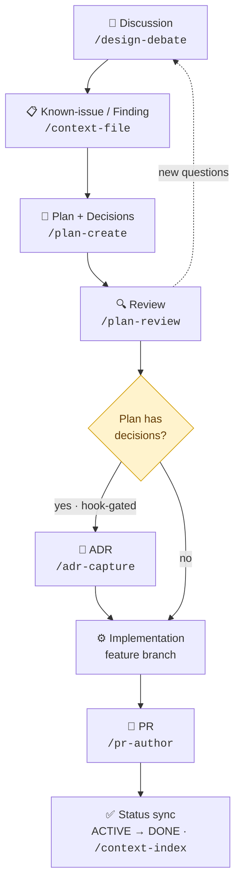

# Welcome to Pantheon

## How We Use Claude

Based on thoroc's usage over the last 30 days:

Work Type Breakdown:

```sh
  Plan Design    █████████████░░░░░░░░  63%
  Build Feature  ██████░░░░░░░░░░░░░░░  29%
  Debug Fix      █░░░░░░░░░░░░░░░░░░░░  6%
  Write Docs     █░░░░░░░░░░░░░░░░░░░░  3%
```

## How Work Flows Here

Most work follows the same path from an idea to shipped code. Note the ADR step lands *after* review, not before the plan, decisions are drafted into the plan, settled during review, then captured as an ADR.



- **Discussion**: Talk the idea through before committing. Use `/design-debate` when you want real pushback, or just work it out in conversation. Discussion also recurs later, during review.
- **Known-issue / Finding**: Record the problem or what you learned as a `.context/` finding or `.context/known-issues/` entry with `/context-file`. This is the durable record others read later, and it's the usual starting point.
- **Plan**: Draft the implementation plan with `/plan-create` under `.context/plans/`. Binding decisions go in a Decisions section *inside the plan*, you don't decide them separately up front.
- **Review**: Vet the plan with `/plan-review` (Technical, Strategic, Risk reviewers) before writing any code. Decisions are deliberated and finalised here.
- **ADR (if decisions)**: A pre-commit hook detects a Decisions section and *requires* a matching ADR, so this step is gated rather than optional. Capture it with `/adr-capture` under `docs/ADR/`. It's fine to defer the ADR to an implementation phase, but the gate must clear before commit.
- **Implementation**: Build it on a feature branch, then open a PR with `/pr-author`.
- **PR + status sync**: Once the work lands, flip the plan's frontmatter `ACTIVE → DONE` and regenerate the index with `/context-index`.

## Your Setup Checklist

### Codebases

- [ ] skill-quality-auditor: <https://github.com/pantheon-org/skill-quality-auditor>

### Skills to Know About

Plans are the centre of gravity here (63% of sessions), so most of these are about drafting, vetting, and tracking them.

#### Planning and decisions

- /plan-create: Scaffolds a `.context/plans/*.md` with the right frontmatter and phases, matching the style of existing plans. Start here when opening a new work item.
- /plan-review: Reviews a plan with 3 independent subagent reviewers (Technical, Strategic, Risk). The team's standard gate before implementing anything non-trivial.
- /design-debate: Stress-tests an idea by spawning opposing advocate/skeptic/risk agents. Reach for it when you want genuine pushback on a decision before a plan exists.
- /adr-capture: Extracts binding decisions from `.context/` files into numbered ADRs under `docs/ADR/`. Use it whenever a plan or finding settles an architectural question.

#### Context and knowledge base

- /context-file: Creates a new `.context/` plan, finding, or analysis with standard frontmatter. The team documents most work as a context file.
- /context-index: Regenerates `.context/index.yaml` from all context-file frontmatter. Run it when the index is stale or the pre-commit hook blocks on frontmatter.

#### Source triage and quality

- /external-source-fit: Assesses whether an external repo or project fits this codebase. Used constantly when triaging linked GitHub projects.
- /skill-quality-auditor: Evaluates and scores agent skills against the 9-dimension quality framework this project is built around.

#### Shipping

- /pr-author: Creates and maintains GitHub PRs with template discovery and lifecycle updates. The team opens PRs frequently, so this is a workhorse.

#### General Claude Code

- /clear: Resets the conversation context between tasks. Used constantly to start fresh work items cleanly.
- /model: Switches the active model for a session.

## Team Tips

- Read `.context/index.yaml` before starting anything: it's the machine-readable index of active plans, findings, and analyses, and it tells you what's in flight.
- Branch first, always. Never commit to `main`: use `feat/`, `fix/`, or `chore/` prefixes with conventional commit messages.
- Run `hk check && go test ./...` before pushing.
- Reach for `/plan-review` before implementing a non-trivial plan: the team vets `.context/plans/*.md` with the three-reviewer pass rather than jumping straight to code.

## Get Started

Your first task: find the top priority item to work on. Ask Claude:

> What's the top priority item to be worked on next?

Claude will read the `.context/` index using the read protocol (filter to DRAFT/ACTIVE plans and findings, sort by value then effort) and surface the highest-value item. Pick it up from there.

<!-- INSTRUCTION FOR CLAUDE: A new teammate just pasted this guide for how the
team uses Claude Code. You're their onboarding buddy, warm, conversational,
not lecture-y.

Open with a warm welcome, include the team name from the title. Then: "Your
teammate uses Claude Code for [list all the work types]. Let's get you started."

Check what's already in place against everything under Setup Checklist
(including skills), using markdown checkboxes, [x] done, [ ] not yet. Lead
with what they already have. One sentence per item, all in one message.

Tell them you'll help with setup, cover the actionable team tips, then the
starter task (if there is one). Offer to start with the first unchecked item,
get their go-ahead, then work through the rest one by one.

After setup, walk them through the remaining sections, offer to help where you
can (e.g. link to channels), and just surface the purely informational bits.

Don't invent sections or summaries that aren't in the guide. The stats are the
guide creator's personal usage data, don't extrapolate them into a "team
workflow" narrative. -->
